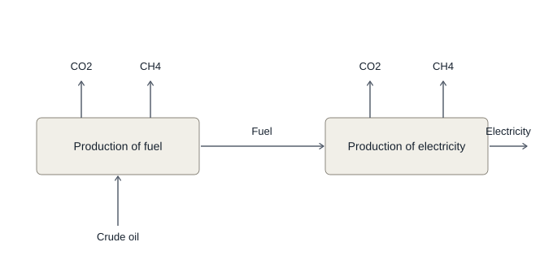
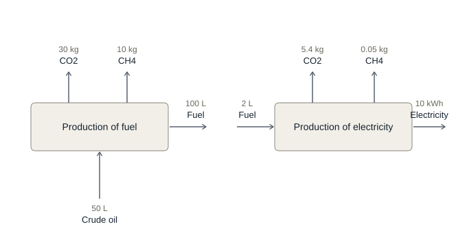
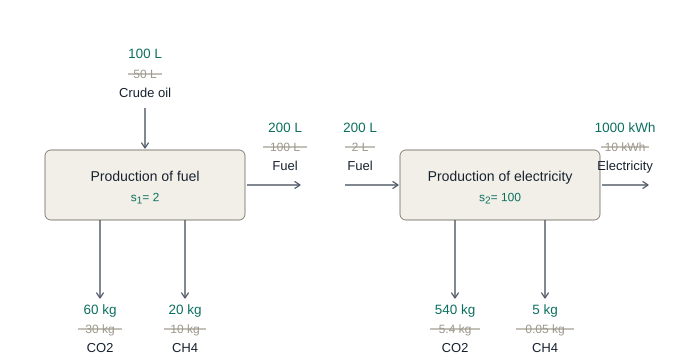

# Scaling a two-process system

**A worked GWP calculation**

Two unit processes, two greenhouse gases, and one functional unit. Every number below is computed by scaling each process directly — no matrix algebra, nothing that can't be done on paper.

**Functional unit = 1000 kWh electricity**

---

## 01 — What the system is made of

Before any numbers, the shape of the system. Crude oil is drawn from nature and turned into fuel. That fuel is burned to make electricity. Both processes release carbon dioxide and methane to air.



*Fig. 1 — Structure only. Arrows into a box are inputs, arrows out are outputs, arrows to the top are emissions to air. Fuel is what links the two processes.*

---

## 02 — Each process at its own reference flow

Now the quantities. Each process is documented at a **reference flow** chosen by whoever collected the data — the fuel process per 100 litres of fuel produced, the electricity process per 10 kWh produced.

The two were written independently, so they don't line up. The fuel process offers 100 litres; the electricity process wants 2. That mismatch is why the arrow linking them is now drawn as two separate arrows.



*Fig. 2 — Reference flows as documented. 100 L out, 2 L in: the two processes are not yet connected.*

---

## 03 — Scale each process to the functional unit

Start at the end. The electricity process makes 10 kWh and we need 1000, so its **scaling factor is s₂ = 100**. Scaled by 100, it consumes 200 litres of fuel.

Now work upstream. The fuel process makes 100 litres per run and we need 200, so **s₁ = 2**. Multiply every flow in each box by that box's own scaling factor.



*Fig. 3 — Crossed out: the reference amounts. Above them: the same flows scaled. The fuel output and fuel input now agree at 200 L, which is what the scaling was for.*

---

## 04 — Life cycle inventory (LCI)

### Total every flow crossing the system boundary

Read the scaled numbers off the diagram and add them. One sum per flow, across both processes. The result is the **life cycle inventory**: everything the system draws from nature and everything it releases, for one functional unit.

**Carbon dioxide**

```
  fuel           60 kg
  electricity   540 kg
                ------
                600 kg
```

**Methane**

```
  fuel            20 kg
  electricity      5 kg
                ------
                  25 kg
```

**Crude oil**

```
  fuel          100 L
  electricity      —
                ------
                100 L
```

Collected together, that is the LCI result. Note that it mixes both directions across the boundary: crude oil flows in from nature, the two gases flow out to air.

| Elementary flow | Compartment | Direction | Amount |
|---|---|---|---|
| Crude oil | natural resource | input | 100 L |
| Carbon dioxide | air | emission | 600 kg |
| Methane | air | emission | 25 kg |

The inventory is a physical statement — kilograms and litres, nothing interpreted. Deciding what it *means* is a separate phase, and that is what comes next.

---

## 05 — Life cycle impact assessment (LCIA)

### Characterize the inventory against an impact category

Kilograms of different gases can't simply be added. Each is multiplied by a **characterization factor** that expresses its warming effect relative to carbon dioxide. These are the IPCC AR6 values over a 100-year horizon.

This is where the LCI stops being a list of masses and becomes a score in a chosen impact category. Only the flows with a nonzero factor for that category take part.

**Global warming potential, 100 years**

```
  CO2    600 kg  ×  1     =   600.0 kg CO2-eq
  CH4     25 kg  ×  29.8  =   745.0 kg CO2-eq
                             ----------------
                     total    1345.0 kg CO2-eq
```

Crude oil has no global warming factor — its factor is zero, so it drops out of this category entirely. It would appear instead under a resource category such as fossil depletion.

### 1345 kg CO2-eq per 1000 kWh of electricity

---

## 06 — LCIA contribution analysis

### Where the impact actually came from

The factor column is where the two gases part ways.

| Flow | Mass | Factor | Contribution | Share of impact |
|---|---|---|---|---|
| CO2 | 600 kg | 1 | 600.0 | 45% |
| CH4 | 25 kg | 29.8 | 745.0 | 55% |
| **Total** | **625 kg** | — | **1345.0** | **100%** |

Methane is 25 kilograms next to 600 — four percent of the mass leaving the system — and yet it is the **larger** of the two contributors to climate impact. The characterization factor of 29.8 more than reverses the ranking. Sorting the inventory by mass would put methane a distant second; sorting by impact puts it first. This is the reason characterization exists, and it is visible in one line of arithmetic.
